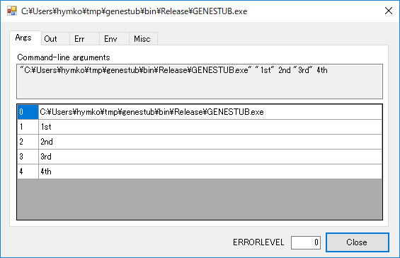
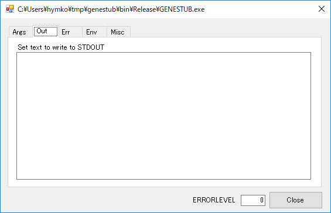
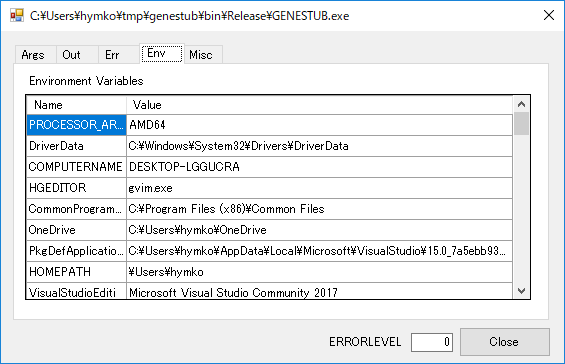

GENESTUB.exe
============

This program is to test that the childprocess is called as expected.

When GENESTUB.exe was called, 

* It displayed the command-line arguments.
* You can set these for parent process.
    * ERRORLEVEL
    * Stanard-output
    * Standard-error

Do build, though the name of executable is GENESTUB.exe ,
you can rename GENESTUB.exe as you like for parent applications.

